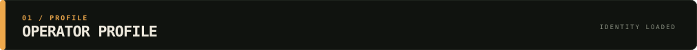
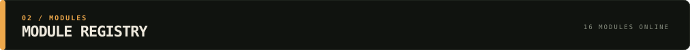
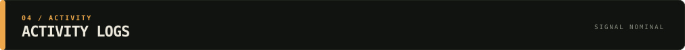
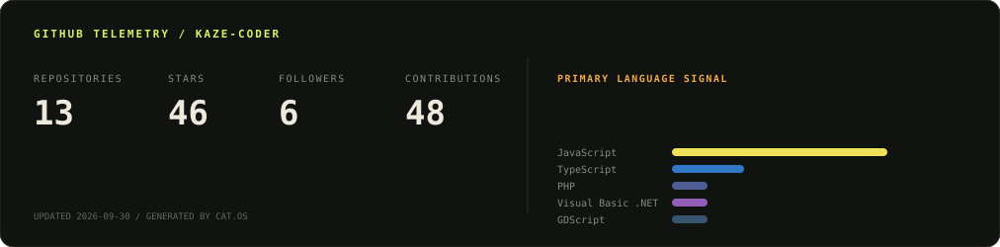
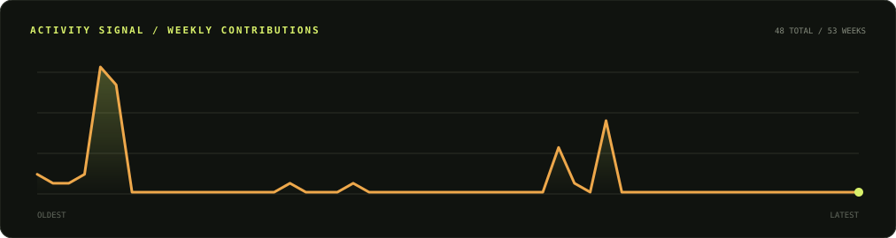
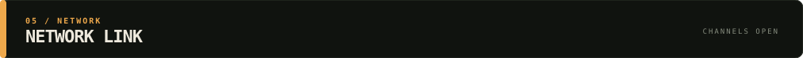
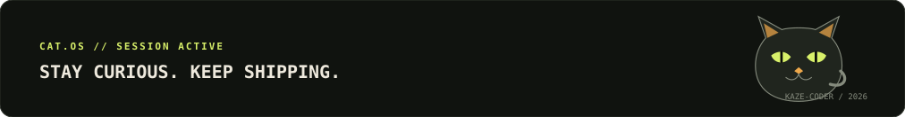

<!-- Cat.OS profile assets are generated from scripts/*.mjs. -->



<table width="100%">
<tr>
<td width="66%" valign="middle">

### Automation-focused developer from Indonesia

I build useful web products, bots, and small systems that turn repetitive work into reliable workflows. Curious by nature, practical by default.

`CURRENT_MODE: BUILDING` &nbsp; `SYSTEM_STATUS: PURRING`

</td>
<td width="34%" valign="middle" align="center">


<br><br>



</td>
</tr>
</table>




<table width="100%">
<tr>
<td width="58%" valign="top">

**Kaze** is a developer and persistent learner who enjoys connecting modern web development with automation. The goal is simple: build things that are useful, understandable, and worth maintaining.

- Web interfaces and full-stack experiments
- Bots, APIs, and workflow automation
- Games and interactive side projects
- Learning by shipping real repositories

</td>
<td width="42%" valign="top">

```text
CAT.OS // OPERATOR PROFILE
--------------------------
ROLE       Automation Developer
LOCATION   Indonesia
FOCUS      Web + Automation
STATE      Always Learning
SIGNAL     Open to Collaborate
```

</td>
</tr>
</table>




#### Core Web


#### Automation + Backend


#### Ship Tools




<table width="100%">
<tr>
<td width="50%" valign="top">

### [PRDly](https://github.com/Kaze-coder/PRDly)
TypeScript product workflow tooling and experimentation.

`TYPESCRIPT` `ACTIVE`

</td>
<td width="50%" valign="top">

### [Web Citra](https://github.com/Kaze-coder/Web-Citra)
An interactive JavaScript web experience.

`JAVASCRIPT` `ACTIVE`

</td>
</tr>
<tr>
<td width="50%" valign="top">

### [Mickey Bot](https://github.com/Kaze-coder/mickey-bot)
Discord automation built with JavaScript and Node.js.

`NODE.JS` `BOT`

</td>
<td width="50%" valign="top">

### [Portfolio](https://github.com/Kaze-coder/Portofolio)
Personal work, experiments, and selected projects.

`JAVASCRIPT` `SHOWCASE`

</td>
</tr>
</table>






<br>



<picture>
  <source media="(prefers-color-scheme: light)" srcset="https://raw.githubusercontent.com/Kaze-coder/Kaze-coder/output/github-contribution-grid-snake.svg">
  <source media="(prefers-color-scheme: dark)" srcset="https://raw.githubusercontent.com/Kaze-coder/Kaze-coder/output/github-contribution-grid-snake-dark.svg">
  
</picture>




Open to ideas, collaborations, and useful experiments. If it can be made clearer, faster, or less repetitive, I want to hear about it.

<a href="mailto:kazumaagain@gmail.com"></a>
<a href="https://www.instagram.com/kazevalkhov/"></a>


<br><br>


